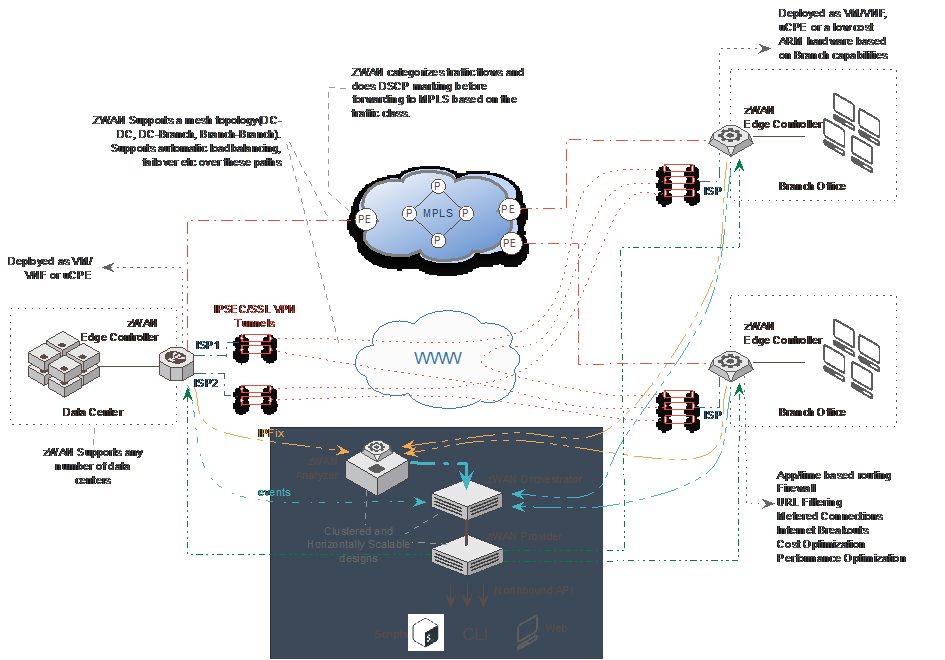

# SDWAN - zWAN

### INTRODUCTION

zWAN is Amzetta's implementation of SDWAN solution. zWAN is targeted
towards small to midsize enterprises that are looking to incorporate
SDWAN into their networking infrastructure.

Amzetta's zWAN is composed of two major parts

-   A centralized management/orchestration server (or cluster of
    servers) responsible for the management plane and certain control
    plane activities.

-   A distributed edge controller(s) that is responsible for data-plane
    activities.

### HIGH LEVEL ARCHITECTURE

### SALIENT FEATURES

-   Topology support -- Hub and spoke, hybrid topologies.

-   Centralized Management and multi-tenancy.

    -   Centralized Policy and Auto Policy

    -   Active directory, open ID

    -   Multi-factor authentication

    -   Role based authorization

-   Clustered Management and Orchestration Servers

    -   Failover, load balancing.

    -   Scale out as more edge controllers are added.

-   Data plane separate from Management and control planes

    -   Data traffic does not flow through the management servers.
        Customer's data is not passed to management servers.

    -   Enables SDWAN as a service.

-   Monitoring and Reporting

-   Edge controller supports heterogeneous hardware

    -   ARM, x86/64 CPE, VM

-   Value Added Functions

    -   Multi-path WAN connectivity

        -   IPSEC/SSLVPN one-to-many tunnel

        -   Multiple tunnels

        -   Asymmetric WAN links

    -   Inbound/outbound load balancing across multiple WANs

    -   Fault tolerance, automatic outage detection and recovery

    -   QoS Tagging, Flow classification and prioritization.

    -   TWAMP, flow optimizer, IPFIX

    -   Dynamic routing, BGP, OSPF

### CPE1.2: QA build - Dec 20
    
-  Webssh

-  Categrory and FQDN (flow classification, global block)

-  MAC allow/block

-  Geofencing based on Trusted MAC

-  NB - Branch Subnet with IPSET

-  DNS filtering

-  SaaS breakout without flow control and path affinity

-  Resolve LANIP

-  IPSET (Flow Classification Rules)

-  SNMPv3 (Local WebUI)

-  CPE config backup and restore

-  Single report file

-  Saas Flow control and path affinity

-  WIFI AP and Station

-  Server side report generation

-  LLDP

-  Latest nDPI (zoom and line)
  -----------------------------------------------------------------------

### SUPPORTED CPE HARDWARE (VCPE) 

-   Must support Linux kernel 4.19 or greater

-   eMMC storage is preferred for CPE

-   Must support driver for internal distributed switch (LAN ports)

-   Must support driver for LTE modem

    -   Must have provision for LTE antenna

-   Must support H/W offloading for better encryption and compression

-   To run as vCPE (host system should support VT-x and VT-d)