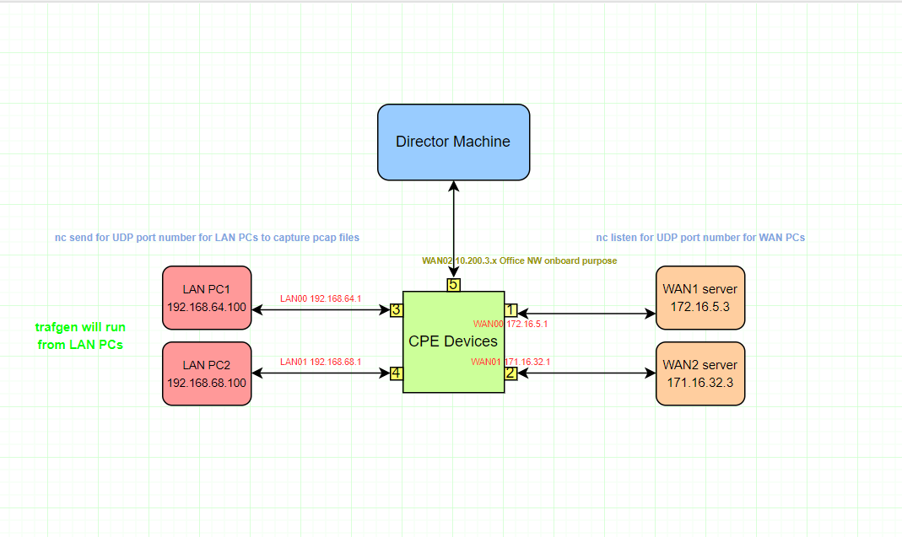

# Trafgen - Setup and Execution Document

### Pre-requisites for Setup: (Physical hardware’s)

1.	Two * WAN machines installed with Ubuntu 18.04 and above. 
2.	CPE Devices with latest Firmware installed. ( For this setup used Kettop)
3.	Two * LAN PCs installed with Ubuntu 18.04 and above.
4.	Director Server with latest TAG versions for onboard CPE devices.
5.	Install netsniff-ng software in LAN PC machines.

| Eth Packet size | No of Packets | % Packet Distribution |
| ------ | ------ | ------ |
| 64 | 7 | 58.33% |
| 594 | 4 | 33.33% |
| 1518 | 1 | 8.33% |

Ethernet Packet Size – Includes frame header size.

#### Imix Patterns to be test:

###### Test 1: 64 byte with 7 packets
###### Test 2: 594 byte with 4 packets
###### Test 3: 1500 byte with 1 packet
###### Test 4: Run all Test 1,2and3

### Configuration procedure for Trafgen Testing:

As per above diagram perform the setup, once it ready kindly follow the below mentioned steps. Make sure from LAN PC machines able to ping the WAN machines IPs.

1.	From WAN1 server(172.16.5.3), run the nc command with udp port 2000

Example: nc –l –u –s <bind source IP > -p 2000

2.	From LAN PC1, run the nc command with same udp port 2000

Example: nc –u 172.16.5.3 2000

Now type some words to make sure both side able to see the typed words. If it comes then command and communication is working fine. Stop both the nc commands.

3.	Now we can start prepare and capture the pcap files for imix patterns. Since Trafgen, require .cfg as input file. In order to create the .cfg file, first we need to capture pcap files for imix data pattern between WAN and LANPC machines. Then we can convert the pcap files from .pcap to .cfg using netsniff-ng command.
4.	Below is the example of imix test 64-byte pattern for generate the .cfg file format for Trafgen. Same thing need to perform for other imix patterns.

#### Step 1:

From WAN server:

nc –l –u –s 172.16.5.3 –p 2000

From LAN PC behind CPE devices:

nc –u 172.16.5.3 2000 

#### Step 2:

1.	From CPE device and then hit enter to start capture and save it in a file.

tcpdump –i < LAN interface name> port 2000 –n –w imix64byte.pcap

2.	From LAN pc machine, which is already, nc command started. Now type these words to capture 64-byte imix pattern and enter this for 7 times.

hello world sdwan technologies Stortrends cep   
hello world sdwan technologies Stortrends cep   
hello world sdwan technologies Stortrends cep   
hello world sdwan technologies Stortrends cep   
hello world sdwan technologies Stortrends cep   
hello world sdwan technologies Stortrends cep   
hello world sdwan technologies Stortrends cep   

3.	Now kill the nc command and stop the tcpdump command and pattern is saved in file.
4.	Transfer the saved .pcap files to LAN PC and then run the below command to change from .pcap to .cfg file format.

netsniff-ng --in dump.pcap --out dump.cfg

#### Step 3:

Run the below command to send the packets from LAN pc to WAN side.

trafgen --dev LAN PC interface name --conf dump.cfg

Note: If u want to stop the execution press ctrl + c. By default trafgen will take all the threads in CPE.  
Incase if we need to reduce the cpu cores/threads give the option -p number of threads  

Example: trafgen --dev LAN PC interface name --conf dump.cfg -P 2  

In test 3 sometimes CPE gets hang becasue of all cores/threads are utilizied fully. So we can reduce the cores/threads with given example above.  
Even though if we reduce the threads there is no difference in the output as far observed.

#### Step 4:

Monitor the pps and mbps using iptraf-ng –d LAN interface name -t 100 from CPE devices.

#### Step 5: 

To calculate the mpps/kpps using the method and latency too.

1.	pps value divided by 1000 to get kpps and again 1000 to get mpps.
2.	Take 1000000 divided by pps value to get latency value.

Note:

1.	Above execution, methods will map one LAN interface to one WAN interface. If we have multiple LAN and WAN we need to run the execution method separately for each.
2.	Need to get all the imix patterns results like above execution methods.

### For References,

#### Trafgen links:

https://manpages.ubuntu.com/manpages/xenial/man8/trafgen.8.html

Other Sample imix pattern data other then 64 byte,

#### imix Test2:

hello world sdwan technologies Stortrends ceph storage cloud storage vvvvvvvvvvvvvvvvvvvvvvvvvvvvvvvvvvvvvvvvvvvvvvvvvvvvvvvvvvvvvvvvvvvvvvvvvvvvvvvvvvvvvvvvvvvvvvvvvvvvvvvvvvvvvvvvvvvvvvvvvvvvvvvvvvvvvvvvvvvvvvvvvvvvvvvvvvvvvvvvvvvvvvvvvvvvvvvvvvvvvvvvvvvvvvvvvvvvvvvvvvvvvvvvvvvvvvvvvvvvvvvvvvvvvvvvvvvvvvvvvvvvvvvvvvvvvvvvvvvvvvvvvvvvvvvvvvvvvvvvvvvvvvvvvvvvvvvvvvvvvvvvvvvvvvvvvvvvvvvvvvvvvvvvvvvvvvvvvvvvvvvvvvvvvvvvvvvvvvvvvvvvvvvvvvvvvvvvvvvvvvvvvvvvvvvvvvvvvvvvvvvvvvvvvvvvvvvvvvvvvvvvvvvvvvvvvvvvvvvvvvvvvvvvvvvvvvvvvvvvvvvvvvvvvvvvvvvvvvvvvvvvvvvvvvvvvvvvvvvvvvvvvv

#### imix Test3:

sssssssssssssssssssssssssssssssssssssssssssssssssssssssssssssssssssssssssssssssssssssssssssssssssssssssssssssssssssssssssssssssssssssssssssssssssssssssssssssssssssssssssssssssssssssssssssssssssssssssssssssssssssssssssssssssssssssssssssssssssssssssssssssssssssssssssssssssssssssssssssssssssssssssssssssssssssssssssssssssssssssssssssssssssssssssssssssssssssssssssssssssssssssssssssssssssssssssssssssssssssssssssssssssssssssssssssssssssssssssssssssssssssssssssssssssssssssssssssssssssssssssssssssssssssssssssssssssssssssssssssssssssssssssssssssssssssssssssssssssssssssssssssssssssssssssssssssssssssssssssssssssssssssssssssssssssssssssssssssssssssssssssssssssssssssssssssssssssssssssssssssssssssssssssssssssssssssssssssssssssssssssssssssssssssssssssssssssssssssssssssssssssssssssssssssssssssssssssssssssssssssssssssssssssssssssssssssssssssssssssssssssssssssssssssssssssssssssssssssssssssssssssssssssssssssssssssssssssssssssssssssssssssssssssssssssssssssssssssssssssssssssssssssssssssssssssssssssssssssssssssssssssssssssssssssssssssssssssssssssssssssssssssssssssssssssssssssssssssssssssssssssssssssssssssssssssssssssssssssssssssssssssssssssssssssssssssssssssssssssssssssssssssssssssssssssssssssssssssssssssssssssssssssssssssssssssssssssssssssssssssssssssssssssssssssssssssssssssssssssssssssssssssssssssssssssssssssssssssssssssssssssssssssssssssssssssssssssssssssssssssssssssssssssssssssssssssssssssssssssssssssssssssssssssssssssssssssssssssssssssssssssssssssssssssssssssssssss

#### imix Test 4:

Combination of all above Test 1,2 and 3.
