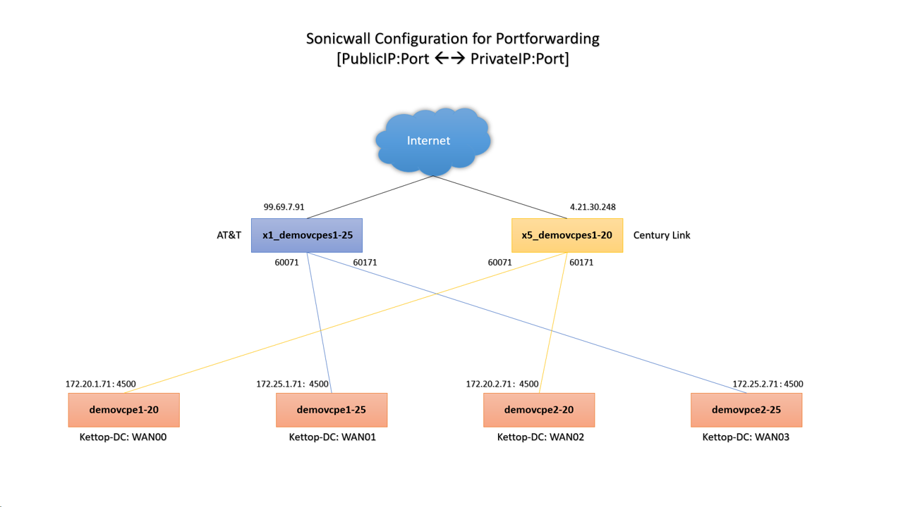
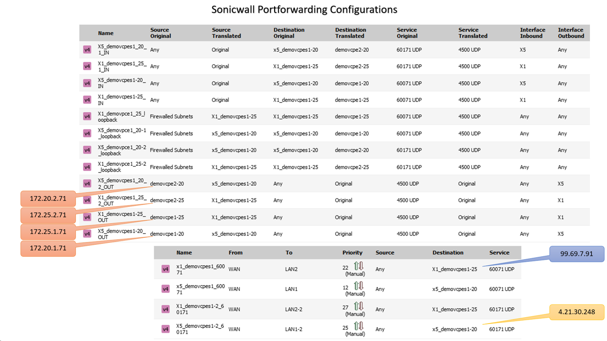
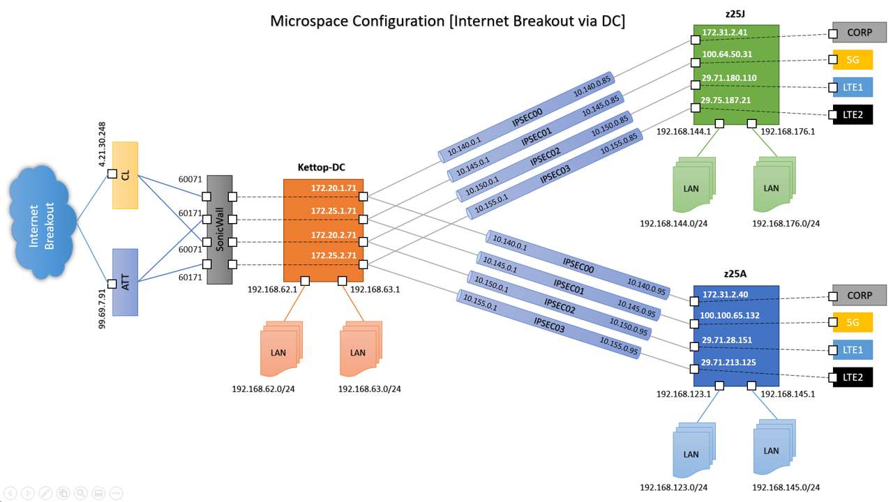

# Microspace PoC Setup

### Overview

**Microspace** customer showed interested in our zWAN product.  So we would like to preconfigure the setup here and ship it to customer.  We used one **Kettop** hardware for *Concentrator* and two **z25** hardware for *Branches*. Both the branch used "3 SIM & 1 Broadband" for WAN, and 2 LAN subnets.  To support "4 tunnels" in concentrator with just two *PUBLIC IPs*, we requested MIS to configure port forwarding in the **Sonicwall**.  With 2 public IPs and two public port, we can forward it to 4 private IPs.

### Port Forwarded Setup in Sonicwall

The above setup used two Public IPs & Public Ports rempas to 4 Private IPs:
- 4.21.30.248:60071 [*Century Link*] --> 172.20.1.71
- 4.21.30.248:60171 [*Century Link*] --> 172.20.2.71
- 99.69.7.91:60071 [*AT&T*] --> 172.25.1.71
- 99.69.7.91:60171 [*AT&T*] --> 172.25.2.71

The above configuration shows IN & OUT rules for port forwarding.

### zWAN configuration

The below diagram shows the detailed configuration created for Microspace PoC with Internet Breakout via DC.

