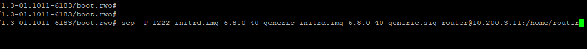

© 2024 AmZetta LLC	Confidential

## **Procedure For Modify CPE Firmware RO to RW Image – ARM hardware:**

## **For ARM:**

-   Access the **Banana Pi system** (**AMZ7622, BPI-R64, BPI-R3, BPI-R4,
    CWAN801**) using the respective credentials (**username: router, password: zWAN@teamw0rk**). Once logged in, enter the
    bash environment by selecting option **8765** in the
    **amz_Secureshell**. When prompted, enter the password: **zwan_unlock**.

> 

-   Once redirected to the bash terminal, check the firmware version by
    running the following command

>   **\$ cat /etc/fwinfo**
>
> 
>
> The output will display the firmware version, such as:
> version=1.3-01.1011

-   Access the corresponding current version build located
    in **/home/qarelease** on the respective build machine. Choose the
    desired hardware model. \[**amz7622, bpir64, bpi-r3, bpi-r4,
    cwan801**\]

> For instance, to select the bpi-r4 model,
>
> **Ex: cd /home/qarelease/1.3-01.1011/bpi-r4/**
>
> 

-   Create a temporary directory named p1 and mount the build file:

> **Ex: mkdir p1**

-   Mount the **build-bpi-r4-1.3-01.1011-Sep27-2024-212924.bin** file on
    p1 temp directory.

> **Ex: mount build-bpi-r4-1.3-01.1011-Sep27-2024-212924.bin p1**

-   Change to the **p1/boot_dev** directory, where the **image.fit.dev** file is
    located after mount is success.

> **Ex: cd p1/boot_dev/**
>
> 

-   Copy the **image.fit.dev** file to the bananapi system\'s **/home/router/**
    directory.

> **Ex: scp -P 1222 p1/boot_dev/image.fit.dev
> router@10.200.3.11:/home/router/**
>
> 

-   Rename the copied file to replace the existing **Image.fit** in
    the **/boot** directory on bananapi system.

> **Ex: mv /home/router/image.fit.dev /boot/Image.fit.**
>
> 

-   Finally, reboot the device. The system will now boot in read-write
    mode.

## **For x86:**

-   Access the **x86 System (KETTOP CELERON, KETTOP I7)** using the
    respective credentials (**username: router, password: zWAN@teamw0rk**). Once logged in, enter the bash environment
    by selecting option **8765** in the **amz_Secureshell**. When prompted,
    enter the password: **zwan_unlock**.

> 

-   Once redirected to the bash terminal, check the firmware version by
    running the following command

> **\$ cat /etc/fwinfo**
>
> 
>
> The output will display the firmware version, such as:
> version=1.3-01.1011

-   Access the corresponding current version build located
    in **/home/qarelease** on the respective build machine. Choose the
    desired hardware model. \[**x86**\].

> For instance, to select the x86 model,
>
> **Ex: cd /home/qarelease/1.3-01.1011/x86/**
>
> 

-   Create a temporary directory named p1.

> **Ex: mkdir p1**

-   Mount the **cpe-fw-images-1.3-01.1011-6183.squash** file
    on **p1** temp directory.

> **Ex: mount cpe-fw-images-1.3-01.1011-6183.squash p1**
>
> 

-   Change to the **p1/boot.rwo/** directory, where the **image.fit.dev** file is
    located after mount is success.

> **Ex: cd p1/boot.rwo/**

-   Copy the **initrd.img-6.8.0-40-generic,
    initrd.img-6.8.0-40-generic.sig** file to the x86 system\'s
    **/home/router** directory.

> **Ex: scp -P 1222 initrd.img-6.8.0-40-generic
> initrd.img-6.8.0-40-generic.sig router@10.200.3.11:/home/router/**
>
> 

-   Rename the copied file to replace the existing files in
    the **/boot** directory on x86 system.

> **Ex: mv /home/router/initrdinitrd.img-6.8.0-40-generic /home/router/initrdinitrd.img-6.8.0-40-generic.sig  /boot/**
>
> 

-   Finally, reboot the device. The system will now boot in read-write
    mode.
