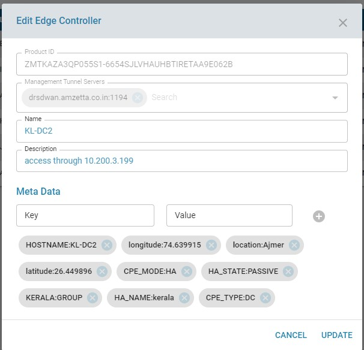
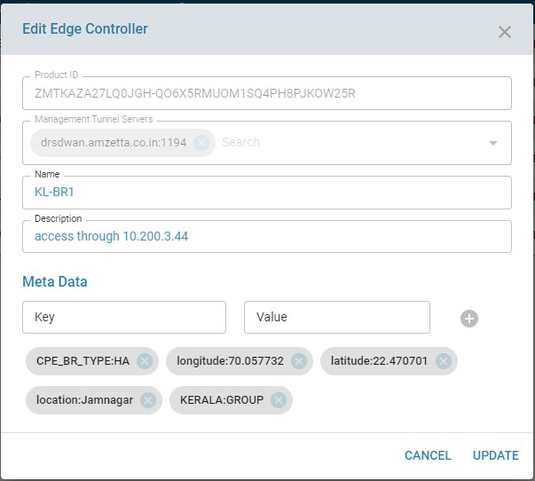
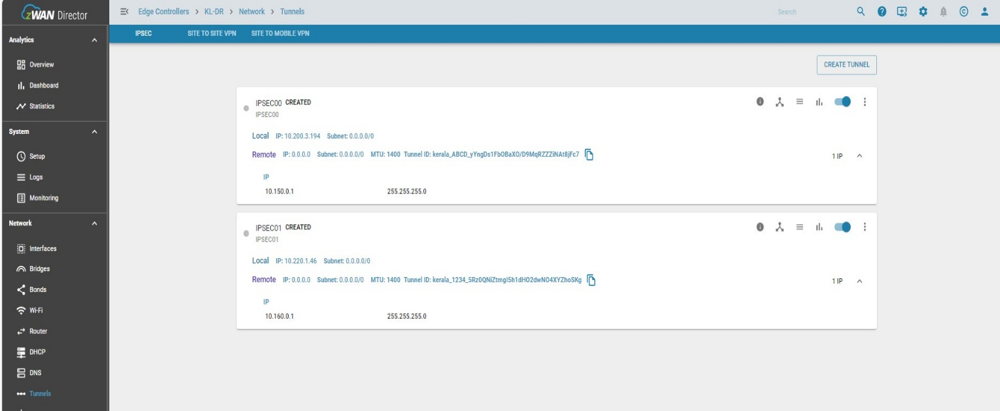
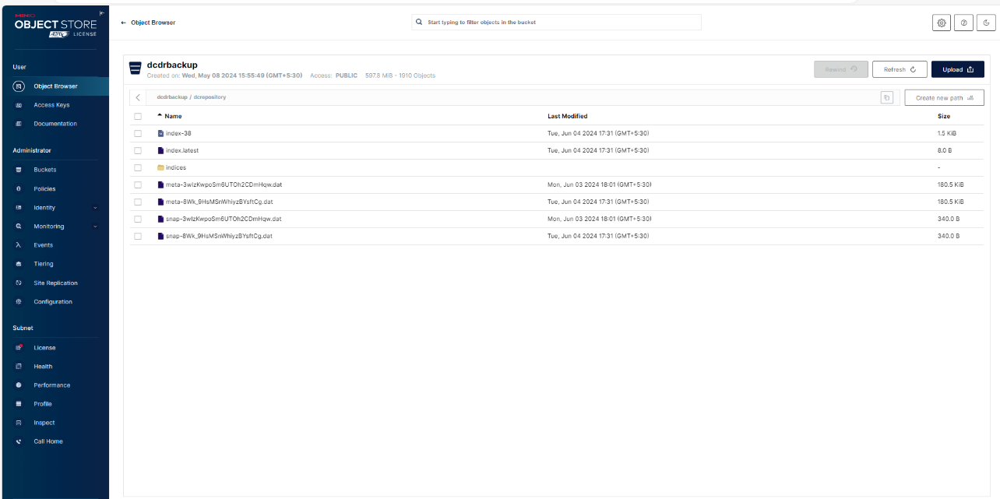

> 

> © 2024 AmZetta LLC Confidential

**CPE – HA – DC DR with DHCP Failover Replication **

**[Table Of Contents:]**

1.  AmZetta SD-WAN Introduction

2.  CPE - HA with DCDR

3.  High Level Diagram 

4.  Setup Configuration

5.  HA Configuration -- DC CPE Active and Passive Nodes and DR CPE Active Node in DC Site Director Server

6.  Configure DHCP Failover Mode in DC- Active and Passive Nodes and DR Active CPE Node

7.  Configure HA Failover Settings in DC CPEs Active and Passive node and DR CPE Active node from Tenant UI

8.  DHCP LAN Subnet Virtual IP Page 13

9.  IPSEC Tunnel Creation 15

10. DC and DR CPE Concentrator Update Update Branch to Active Node: 25

11. DC - DR Director Switchover -- Backup and Restore of MSP Configuration and ELK data

12. SSLVPN Method

# AmZetta SD-WAN Introduction

zWAN is Amzetta's implementation of SDWAN solution. zWAN is target towards small to midsize or large size enterprises that are looking to incorporate SDWAN into their networking infrastructure.

Amzetta's zWAN is composed of two major parts

-   A centralized management/orchestration server (or cluster of
    servers) responsible for the management plane and certain control
    plane activities.

-   A distributed edge controller(s) that is responsible for data-plane
    activities.

2.  **CPE -- HA with DC DR**

In any SDWAN solutions, availability of Datacenter is always more
critical. As an interim solution, we support only ACTIVE-PASSIVE mode in
Datacenter. In this design, there will be single pair or multiple pair
of two Datacenter CPEs per tenant or multiple tenant in the HA cluster
and there will be a switch which both the Datacenter\'s are connected
and in it switch all LAN networks. Even we need to onboard and
configured the DR site CPEs in DC site itself.

All the Datacenter CPEs will have public IP \[WAN\] as an endpoint
through which all the branches will establish their IPSEC tunnels. In
addition, the tunnels are usually one to many from DC. Therefore, if the
ACTIVE Datacenter CPE fails that failure needs to be informed to all
branches and re-establish the connection from the CPE PASSIVE node.

As of today, topology has all the details about both the branches and
their Datacenter w.r.t tunnels.

Therefore, we have created a new micro-service named dc-monitor, that
checks the liveliness of ACTIVE Datacenter CPE and collects the topology
for every few \[say 5\] seconds. If the dc-monitor detects any failure,
then it checks for any passive Datacenter CPE is available to takeover.
If that is available, then the dc-monitor informs all the branches to
connect to the PASSIVE Datacenter CPE and change its state to new
ACTIVE.

Even there is another method to protect the Director Server failure,
meaning in case if Datacenter director server failed for some reasons,
then we need to take Backup of MSP wise and stored in SFTP/S3/minio
server before director server fails. Once the datacenter director server
fails then, we need to restore the backed-up data in another new
director server, which is setup in Disaster Recovery location/site. Once
the DR site UP then DR CPEs will be make as Active and tunnel will be
established with Branch CPEs.

3.  **High Level Diagram.**

Setup Configuration:

 

To Configure the Setup in Primary Director Server, Onboard HA_DC1, HA_DC2, DR CPE, BR1 & BR2 CPE\'s from secure shell or Provisioning server. After onboard, the Director UI should list like shown below: While onboarding, add the metadata to differentiate DC CPE, DR CPE and BR CPE\'s

 

For HA_DC1 \--\> CPE_TYPE = DC, CPE_MODE = HA, HA_STATE = ACTIVE, HA_NAME = Chennai WAN00_PUB_IP:122.60.x.x, WAN00_PUB_PORT:30000

For HA_DC2 \--\> CPE_TYPE = DC, CPE_MODE = HA, HA_STATE = PASSIVE, HA_NAME = Chennai WAN00_PUB_IP:14.187.x.x, WAN00_PUB_PORT:40000

For DR Single Node CPE \--\> CPE_TYPE = DR, CPE_MODE = HA, HA_STATE = ACTIVE, HA_NAME = Chennai WAN00_PUB_IP:14.187.x.x, WAN00_PUB_PORT:50000

 

** Important:** We are support DR CPE Active / Passives nodes too. Since for this scenario we have added only DR CPE Active node alone. If we configured DR CPE Active and Passive nodes then metadata for DR CPEs are like below.

For HA DR CPE Active \--\> CPE_TYPE = DR, CPE_MODE = HA, HA_STATE = ACTIVE, HA_NAME = Chennai WAN00_PUB_IP:14.187.x.x, WAN00_PUB_PORT:50000

For HA DR CPE Passive \--\> CPE_TYPE = DR, CPE_MODE = HA, HA_STATE = PASSIVE, HA_NAME = Chennai WAN00_PUB_IP:14.187.x.x, WAN00_PUB_PORT:50000

# 

** Note:** If any number of WAN interfaces that mapped to public ip or RAW public ip in DC - CPE Active and Passive nodes and DR -- CPE Active / Passive nodes need to add the above-mentioned metadata section. In addition, HA_NAME should be same for both DC and DR CPEs and we have support of single pair OR multiple pair of DC CPEs and DR CPEs in single or multiple tenant.

# 

# DC -- CPE -- Active DC

# DC -- CPE - Passive

# DR -- CPE -- Active

# for BR CPE --> CPE_BR_TYPE = HA

After onboarding everything, list all the edge controllers

**HA Configuration -- DC CPE Active and Passive Nodes and DR CPE Active
Node in DC Site Director Server:**

First, we need to create an IPSEC Tunnels in DC-Active and DC-Passive
nodes using with HA Tunnel Identifier method. In addition, create IPSEC
tunnel for DR CPE node also. Then need to configure IPSEC tunnels from
Branch node with same tunnel ID used in DC-Active node. After that
DC-Active node with branch node will be established. However, DC-Passive
node and DR CPE node will be in created state. Once the DC CPE Active
node down then automatically DC CPE Passive node will take over.

**[Configure LAN Subnets in DC-Active Node:]**

Based on number of LAN Subnets we can add in the corresponding LAN
interfaces, here I have add LAN IP in one of the LAN00 interface. We can
add multiple LAN interfaces too based on requirements.

**[Configure LAN Subnets in DC-Passive Node:]**

Based on number of LAN Subnets we can add in the corresponding LAN
interfaces, here I have add LAN IP in one of the LAN00 interface.
However, both DC-Active and DC-Passive LAN Subnets should be same but
IPs are different.

**[Configure LAN Subnets in DR-Active Node:]**

Based on number of LAN Subnets we can add in the corresponding LAN
interfaces, here I have add LAN IP in one of the LAN00 interface.
However, both DC-Active and DR-Active LAN Subnets should be same IP
address.

**Configure DHCP Failover Mode in DC- Active and Passive Nodes and DR
Active CPE Node:**

This configuration will replicate the DC-Active node LAN DHCP IP address
into DC-Passive node. So when Active node downs all the DHCP LAN IPs
will be replicate to Passive node. Between DC LAN PCs and Branch LAN PCs
will be reachable and able to communicate without down time. In order to
do this we need to configure DHCP failover mode, here Active node will
be primary DHCP server and Passive node will be secondary DHCP server.

Even no need to configure DHCP Failover Mode in DR Active CPE node.

If DR HA CPE configured for Active and Passive nodes then DHCP Failover
should be same like DC HA CPE Active and Passive node.

**[DC CPE-Active Node DHCP Primary server configuration:]**

Here we need to provide the DC CPE-Primary Active node LAN00 Interface
IP address and peer DC CPE-Secondary Passive node same LAN00 Interface
IP address like below.

**Note:** If u have multiple LAN, Subnets IP address in Active and
Passive Nodes. For each LAN IP subnets, we need to configure DHCP
Failover mode.

**[DC CPE-Passive Node DHCP Secondary server configuration:]**

**Note:** For DR CPE-Active Node no need to configure DHCP server configuration below screenshot for reference.

**Configure HA Failover Settings in DC CPEs Active and Passive node and DR CPE Active node from Tenant UI:**

**[HA Failover Mode:]**

Here we need to provide the LAN subnet Virtual IP in DC CPE Active and
Passive node. Same for DR CPE Active nodes. Meaning suppose if we set
LAN00 interface IP is 172.7.0.1 in Active node, then HA virtual IP would
be 172.7.0.5 need to be add in HA Failover setting in UI as per below
diagram.

Make sure if u have multiple LAN interfaces in Active node for each LAN
we need to add virtual IP in HA failover settings in UI.

For DC CPE Passive node, no need to add Virtual IP. Since Virtual IP
will move to passive node when active node is down. Since we already
configured LAN IP in DC CPE passive node with same kind of subnet
address.

For DR CPE node also, if DC CPE active and passive node is down then
virtual ip will move to DR CPE node.

Once Virtual IP add to the DC CPE LAN interfaces as like below diagram.
After that, all the LAN PCs behind DC or DR Concentrator and behind
branch CPEs LAN PCs will be ping each other.

[HA Failover Page:]

[Adding Virtual IP to LAN Interfaces:]

[Virtual IP added to LAN Interfaces:]

**DHCP LAN Subnet Virtual IP Page:**

Once we configure the Virtual IP in HA settings page for LAN Subnet.
Then we need to modify the LAN subnet in DC CPE Active and Passive Node
and for DR CPE Active node in DHCP page. IN DC CPE Active node default
gateway would be mention as Virtual IP and DNS1 IP will be our LAN
Subnet IP and DNS2 IP will be our peer DC CPE passive node LAN subnet IP
and vice versa for DC CPE Passive node too and Need to do for DR CPE
Active Node like below example:

Red Color = Virtual IP which we added in HA Failover page.

Green Color = Actual LAN Subnet IP which we added in Interface UI page.

Blue Color = Peer DC CPE Passive node LAN interface IP

**[Active Node LAN Interface DHCP Subnet Page Setting for Virtual IP:]**

Default Gateway IP: 172.7.0.5 = Virtual IP

DNS1 IP: 172.7.0.1 = LAN interface IP

DNS2 IP: 172.7.0.3 = Peer DC CPE Passive Node LAN Interface IP

**[Passive Node LAN Interface DHCP Subnet Page Setting for Virtual IP:]**

Default Gateway IP: 172.7.0.5 = Virtual IP

DNS1 IP: 172.7.0.3 = LAN interface IP

DNS2 IP: 172.7.0.1 = Peer DC CPE Active Node LAN Interface IP

**[DR CPE Active Node LAN Interface DHCP Subnet Page Setting for Virtual IP:]**

Default Gateway IP: 172.8.0.5 = Virtual IP

DNS1 IP: 172.8.0.1 = LAN interface IP

**IPSEC Tunnel Creation:**

**[HA Tunnel Identifier method during IPSEC tunnel creation:]**

In Branch CPEs, we have multiple IPSEC tunnels like IPSEC00, IPSEC01, or
IPSEC02 will have different tunnel IDs. Using a HA tunnel identifier
name exact branch CPEs of IPSEC tunnel name will be established with DC
CPE Active node only. Based on below mentioned method HA Tunnel
identifier will be create.

**HA_NAME: Kerala** - will be add in metadata tag during onboarding of CPEs. This name should be same for all DC, DR and Branch CPEs.

**HA Tunnel Identifier in Tunnel Creation Page** - Need to provide name or number. This needs to be same for IPSEC00 of DC CPE Active, Passive, DR CPE Active and Branch CPEs and for IPSEC01 it will different name and its same for DC CPE Active, Passive, DR CPE Active and Branch CPEs.

**Tunnel ID** -- Need to be generate key. This needs to be same for DC CPE Active and Branch CPEs. For DC CPE Passive it needs to be different tunnel ID and DR CPE Active will be different tunnel ID.

**[DC- Active Node IPSEC Tunnel Established:]**

**Need to Create an IPSEC Tunnel between DC Active node and Branches and get it established.**

**[DC:]** After Added HA Virtual IP, it will be add to the LAN interfaces of DC CPEs Active Node.

**[DC- Passive Node IPSEC Tunnel Created:]**

**Here we need to create an IPSEC tunnel with different Tunnel ID and it will be in Created state.**

**[Note:] After Failover from Active to Passive node, this node will be change to Active node and IPSEC tunnel will be change to Established state.**

**[DC2:]** Here HA Virtual IP will not be add to the LAN interfaces of DC CPEs Passive Node.

**[DR- CPE Active Node IPSEC Tunnel Created:]**

**Here we need to create an IPSEC tunnel with different Tunnel ID and it will be in Created state.**

**[Note:] after Both DC CPE Active to Passive are down, this node will be change to Active node, IPSEC tunnel will be change to establish state, and it connected with Branch CPEs.**

**[DR CPE Active:]** Here HA Virtual IP will not be add to the LAN interfaces.

**[Branch Nodes IPSEC Tunnel Established with DC-Active Node:]**

Here all branches will be connected with Active node and LAN PCs communication should ping between DC active node and all branches.

Even if DC-Active node fails then failover happens, DC-Passive node becomes DC-Active node and all branches connected with new DC-Active node

Make sure LAN PCs are reachability between DC LAN PCs and all branches LAN PCs.

**[Branch1:]**

**[Branch2:]**

**[DC Monitor Logs:]**

**[Topology View Page:]**

**DC and DR CPE Concentrator Update Update Branch to Active Node Option:**

Update Update Branch to Active Node option use only for the below reason, But routinely all the branch CPEs will get established with corresponding DC CPE Active node or DR CPE Active node.

1.  [Scenario 1:] When DC Concentrator pairs Active and
    passive will connected and established with branch CPEs. After
    failover and failback of DC Concentrator CPEs respective branch CPEs
    will be established with current active CPE, incase if any branches
    not able to establish session with current active DC CPE then click
    the Update Update Branch to Active Node button. Then branch CPEs,
    which is not connected, will be connected with current Active DC
    CPE. Even branch CPEs rebooted or unclean shutdown or hardware
    replaced with new branch CPEs then it should get connect with
    current active CPE. If not, then click Update Update Branch to
    Active Node button to connect the branch CPEs to current active CPE.

2.  [Scenario 2:] When DC Site Director is down and DC CPEs
    are alive, now DR site director will take over and DR Concentrator
    CPEs active or passive will switch over automatically and branch
    CPEs will get established. If any branch CPEs not get establish with
    current DR Active node then click Update Update Branch to Active
    Node button those not connected branch CPEs will connect to DR
    current active node. Even branch CPEs rebooted or unclean shutdown
    or hardware replaced with new branch CPEs then it should get connect
    with current active CPE. If not, then click Update Update Branch to
    Active Node button to connect the branch CPEs to current active CPE.

3.  [Scenario 3:] When DC site director and DC CPEs are
    down, then DR site director will take over and even DR concentrator
    CPE will switch over automatically and all branch CPEs will get
    connected with DR current active CPE. If any branch CPEs not get
    establish with current DR Active node then click Update Update
    Branch to Active Node button those not connected branch CPEs will
    connect to DR current active node. Even branch CPEs rebooted or
    unclean shutdown or hardware replaced with new branch CPEs then it
    should get connect with current active CPE. If not, then click
    Update Update Branch to Active Node button to connect the branch
    CPEs to current active CPE.

4.  [Scenario 4:] When DC Concentrator of DC1 and DC2 CPE
    failed for some reasons may be hardware problem and not deleted from
    List UI page. Now we have to replace and onboard new DC3 and DC4
    CPE. During onboard of DC3 need to provide all the metadata
    information and mentioned as active node and make sure HA name,
    Tunnel identifier should be same as like branch CPEs. But Tunnel ID
    should be different. Same thing need to do for DC4 passive node
    also. Now the entire branch CPEs will be connected with DC3 active
    node after click the Update Branch to Active Node option.

5.  [Scenario 5:] When DC Concentrator of DC1 and DC2 CPE
    failed for some reasons may be hardware problem and deleted from
    List UI page. Now we have to replace and onboard new DC3 and DC4
    CPE. During onboard of DC3 need to provide all the metadata
    information and mentioned as active node and make sure HA name,
    Tunnel identifier should be same as like branch CPEs. But Tunnel ID
    should be different. Same thing need to do for DC4 passive node
    also. Now the entire branch CPEs will be connected with DC3 active
    node after click the Update Branch to Active Node option.

**[More Options in Concentrator Page:]**

1.  Normally if DC CPEs Active and Passive nodes are comes under HA pair
    name to know which CPE is active in that pair like below
    screenshots. Even if we have multiple pair too.

2.  There will be 2 options in each CPEs, like below screenshots

    a.  Interface Status -- If we click the Interface status, Icon it
        will redirect to that CPE interface page.

    b.  Public WAN IP -- If the CPE having public WAN IP will show under
        this option and its fetch from CPE metadata.

**DC - DR Director Switchover -- Backup and Restore of MSP Configuration and ELK data**

**[Create a Bucket at DR Director server using MINIO Console:]**

First login into minio console using the director link as per below and
then create a access key and new bucket for DC -- DR Backup and restore
of data.

**https://IPaddress or FQDN:7081/minio** - it will open the internal s3
bucket minio console for username and password prompt once we provide
the valid details it will logged into minio s3 bucket console. Make sure
TCP port 7081 and 7080 are opened.

Now create a new bucket called dcdrbackup as per below screenshot

After created the bucket change the access policy to public so that data
can transfer and store in this bucket otherwise it will not copy the
data.

Once bucket is created and then need to create, an access key and secret
key for configure the backup and restore configuration in DR Director
MSP login page.

Now we need to configure server configuration in MSP login page to
backup or restore the full director configuration data and ELK data.
Here we need to provide the minio s3 DR site bucket path , Access key
and secret key.

In MSP page, under system tools DB backup we will configure schedule
based cron job backup to take MSP Director full configuration backup and
ELK data backup. Based on schedule time backup will be taken every day
12 PM UTC time zone as per below screenshot.

After schedule time reached, it will take back MSP Director full
configuration in the mentioned path during the server configuration. In
addition, it will create a directory called dcrepository for storing the
ELK data.

**dcrepository** - it will store the DC Director ELK data

Right now it took backup of DC Director MSP full configuration and ELK
data as per below screenshots.

**[Director Full Configuration:]**

**[ELK Data:]**

Same like above method need to configure MSP and ELK Restore schedule
configuration in DR site as per below screenshots

After DC site is down, Will start MSP level restore and ELK data will
initiate the restore process and then make the DR site as Active. Then
scheduled restore configuration started, and then drrepository folder
will be created. It will use to store the ELK data information on this
drrepository folder and other MSP level will be in bucket itself.

**[Restore Operation In DR Site Director:]**

-   In DR Director under deployment folder, failover restore script    
    ./setup.sh standalone dc-to-dr OR if cluster nodes ./setup.sh
    dc-to-dr and after doing restore DR Director become ACTIVE

-   Verify automatic concentrator switchover from DC to DR in
    Concentrator Page.

-   IF CPEs are onboard via provisioning server, then we need to change
    the DR site server management URL. So that the entire branch CPEs
    will get the latest management URL and then IPSEC tunnel will get
    established with DR CPE.

-   All the MSP Level and ELK Data backup will be load based on the
    latest backup files in minio storage.

-   In case, IF CPEs are onboard via Secureshell, then we need to reboot
    the CPEs to get the latest management URL.

**[Restore Script in DR Site Screenshot:]**

**[Note: The above method only for cron based backup and restore. If we need to take on-demand backup and restore]**

**[On-Demand Backup at DC site while under the condition of manual method OR maintenance method.]**

-   In DC Director Server under the deployment folder, need to take on
    demand backup for taking up the latest changes of MSP and ELK data.

    -   ./setup.sh standalone dc-to-dr OR if cluster nodes ./setup.sh
        dr-to-dc

    -   Once it got complete then DC Director will become passive state.

**[DC Site server up with Failback mode:]**

-   In DR Director server under the deployment folder, need to take on
    demand backup for taking up the latest changes of MSP and ELK data.

    -   ./setup.sh standalone dr-to-dc OR if cluster nodes: ./setup.sh
        dr-to-dc

    -   Once it got complete then DR Director will become passive state.

-   In DC Director under deployment folder, failover restore script    
    ./setup.sh standalone dr-to-dc OR if cluster nodes ./setup.sh
    dr-to-dc and after doing restore DC Director become ACTIVE

-   Verify automatic concentrator switchover from DR to DC in
    Concentrator Page.

-   IF CPEs are onboard via provisioning server, then we need to change
    the DC site server management URL. So that the entire branch CPEs
    will get the latest management URL and then IPSEC tunnel will get
    established with DC CPE current Active node.

-   All the MSP Level and ELK Data backup will be load based on the
    latest backup files in minio storage.

-   In case, IF CPEs are onboard via Secureshell, then we need to reboot
    the CPEs to get the latest management URL.

**[Restore Script in DC Site Screenshot:]**

**[Important:]**

Normally ELK data backup functionality will work based on daily-based
cron configuration. In Addition, weekly backup and weekly restore in DR
Director server will do automatically once every Sunday after attaining
the schedule cron time.

Every Sunday, if DC director is in Active state, then weekly backup and
restore will happen automatically in DR server.

To verify whether weekly backup and restore work properly just see the
scheduled cron job log file in MSP account.

Once weekly backup and restore is done, It will delete the ELK data
files in s3 bucket under dcrepo directory.

**[Case1:]**

On Monday, DC site is Active state, but site was failed at after the
cron time ( 6:30AM UTC time Monday ).

For example: afternoon 10:30AM UTC time got failed.

In DR Site Director deployment folder, need to run the ./setup.sh
standalone dc-to-dr OR if cluster nodes ./setup.sh dc-to-dr to take on
demand restore then DR becomes Active state.

On the same Monday, DR site is Active state and its completed its
process of cron time 11:15AM UTC time. Now 11:30AM UTC time an
automatically ELK data backup will kick started and it will be stored in
DR repo directory of S3 bucket.

On Tuesday still DR Director is Active state, now DC site got up. First
we need to run the on-demand backup at DR site using the command
./setup.sh standalone dr-to-dc OR if cluster nodes ./setup.sh dr-to-dc
and the files will stored in drrepo directory. Now we need to on demand
restore at DC site director server by using the command ./setup.sh
standalone dr-to-dc OR if cluster nodes ./setup.sh dr-to-dc

Now ELK data will have the latest changes, DC site will become Active
state, and DR site will move to Passive state.

After successful restore and DC becomes Active state, now Monday and
Tuesday ELK, data files will be deleted from drrepo directory. In
Addition, under dcrepo director ELK data took on Monday via cron will
also be deleted.

This deletion operation in dc and dr repo directory will happen only at
scheduled cron time is reached.

****[For SSL VPN -- CPE HA DC -- DR Implementation:]****

Same Like IPSEC Method there is no differences based on current
Implementation. It will support same tunnel port number OR different
tunnel port number on DC or DR CPEs. IF any changes happen in
implementation then this document will be modify.
